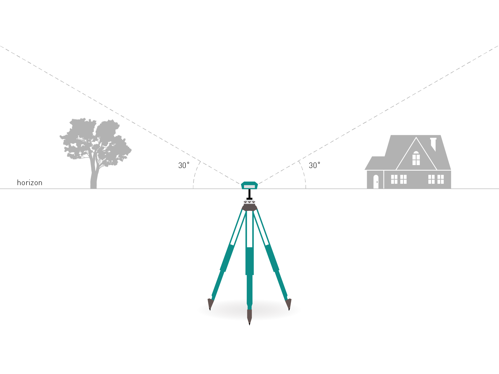
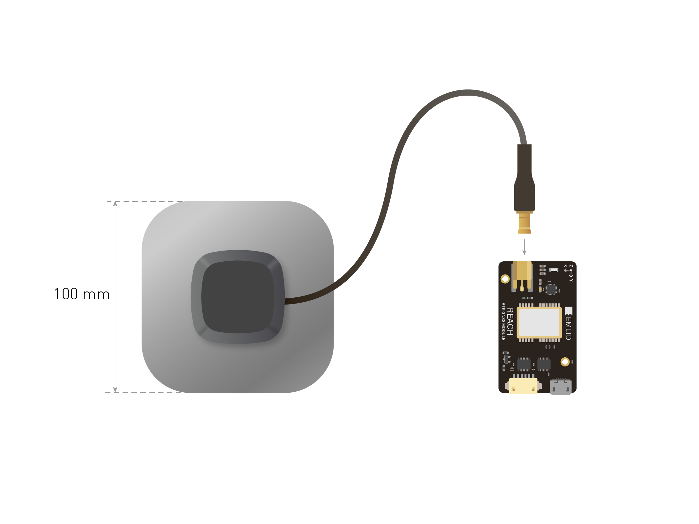

### Bien positionner l'antenne est essentiel pour des solutions RTK de qualité

Vous pouvez disposer votre smartphone près d'une fenêtre dans votre maison et il recevera des coordonnées GPS après un certain temps, mais pour une utilisation RTK ces conditions ne seront pas suffisantes. Pour que le RTK fonctionne, cela nécessite des conditions précises de positionnement de l'antenne qui sont bien plus rigoureuses qu'un GPS autonome.

#### Aucun obstacle obstruant le ciel

L'antenne a besoin d'une vue du ciel dégagée de 30 degrés au dessus du niveau de l'horizon. Il ne doit y avoir aucun obstacle obstruant le ciel : bâtiments, arbres, véhicules, humains, ordinateurs portables, etc...

 

Exemples de **mauvaises** conditions pour positionner l'antenne : en intérieur, zone urbaine, forêt, près du sol.

Exemples de **bonnes** conditions pour positionner l'antenne : un champs, le sommet d'un colline, le toit d'un bâtiment

#### Aucun appareil électronique à proximité

Les appareils électroniques peuvent produire des interférences radios qui peuvent nuire à la bonne réception des signaux GPS. Eloignez tout appareil électronique (également le module Reach lui-même) autant que possible de l'antenne.

#### Plan de masse

L'antenne doit être posée sur un plan de masse qui réduit les trajets multiples, apporte un blindage et améliore la réception des signaux. Le plan de masse est une plaque conductrice, cela peut être un morceau de métal, le toit d'une voiture, le toit métallique d'un bâtiment, etc...

L'antenne Tallysman TW4721 nécessite un plan de masse d'au moins 70x70mm

 
