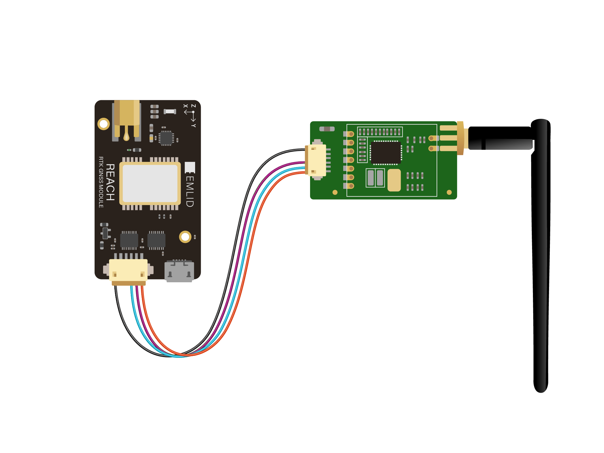
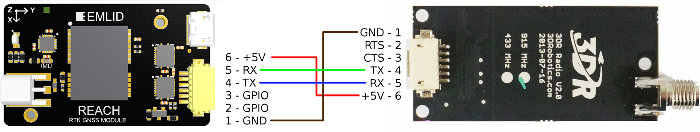

Le module Reach est compatible avec différents accessoires par son port USB OTG intégré et son interface UART du connecteur DF13

### Radio

Il est possible de connecter des modules radio au Reach afin de recevoir des corrections de position ou d'envoyer les coordonnées calculées

Aujourd'hui la plupart des radios fonctionnent avec une interface UART ou USB.

#### Connecter une radio UART

Les niveaux logiques sur l'UART du Reach sont en 3.3V mais les broches sont tolérantes au 5V, donc vous pouvez aussi bien utiliser des radios utilisants des niveaux logiques en 3.3V ou en 5V.

Une radio UART est accessible depuis le module Reach en tant que périphérique série avec le nom **ttyMFD2**.

Pour connecter une radio UART au Reach il faut utiliser le port DF13 du dessus (celui à côté de l'USB).

| broches Reach | broches Radio |
|:-------------:|:-------------:|
|     +5V       |     +5V       |
|     TX        |     RX        |
|     RX        |     TX        |
|     GND       |     GND       |

#### Radio 3DR

 

Schéma de raccordement pour une 3DR Radio v2:

 

Une radio 3DR peut aussi être connectée par l'USB.

Veuillez noter qu'un erreur dans **l'image Reach avant v1.2** empêche le récepteur mobile (Rover) de démarrer tant qu'il reçoit des signaux de corrections sur son port UART envoyé depuis le récepteur fixe (Base).
La solution est d'alimenter le récepteur fixe (Base) une fois que le récepteur mobile (Rover) a démarré (LED clignottantes rouge/bleu/blanc).

#### Radio RFD900

 

Schéma de raccordement pour un radio RFD900:

 

!!! attention
    Veuillez garder à l'esprit qu'une radio RFD peut avoir des pics de consommation jusqu'à 800mA donc assurez-vous que l'alimentation peut délivrer suffisamment pour alimenter à la fois le module Reach et la radio RFD900.

#### Connecter une radio USB

 

Pour connecter une radio USB au module Reach il convient d'utiliser le câble USB-OTH fourni dans la boite.
Brancher la radio sur le port USB-F et brancher l'extrémité Micro-USB du câble au module Reach.
**Si un port USB est utilisé en OTG, alors le module Reach doit être [alimenté](power-supply.md) par un des ports DF13**.
