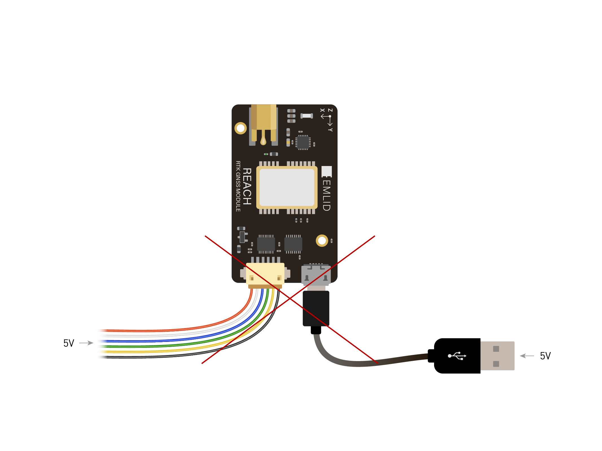
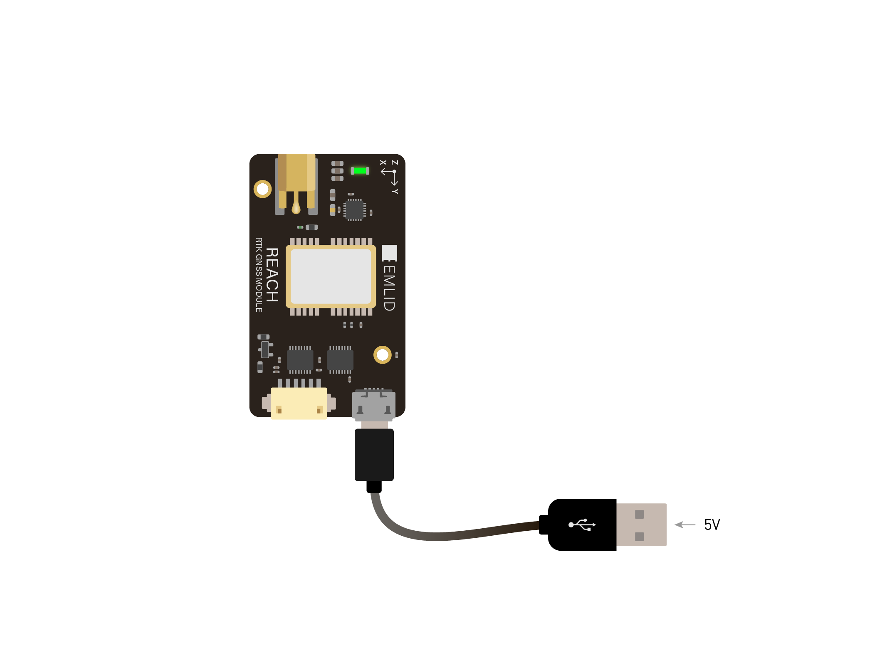
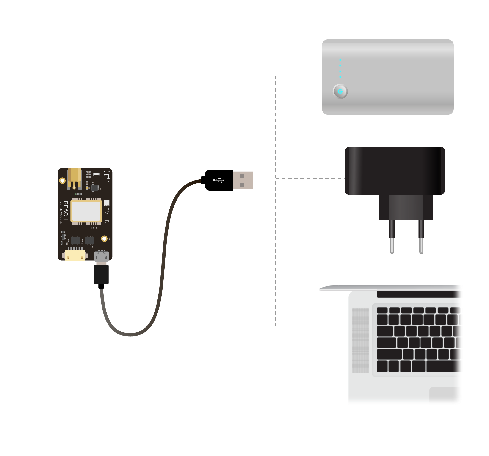
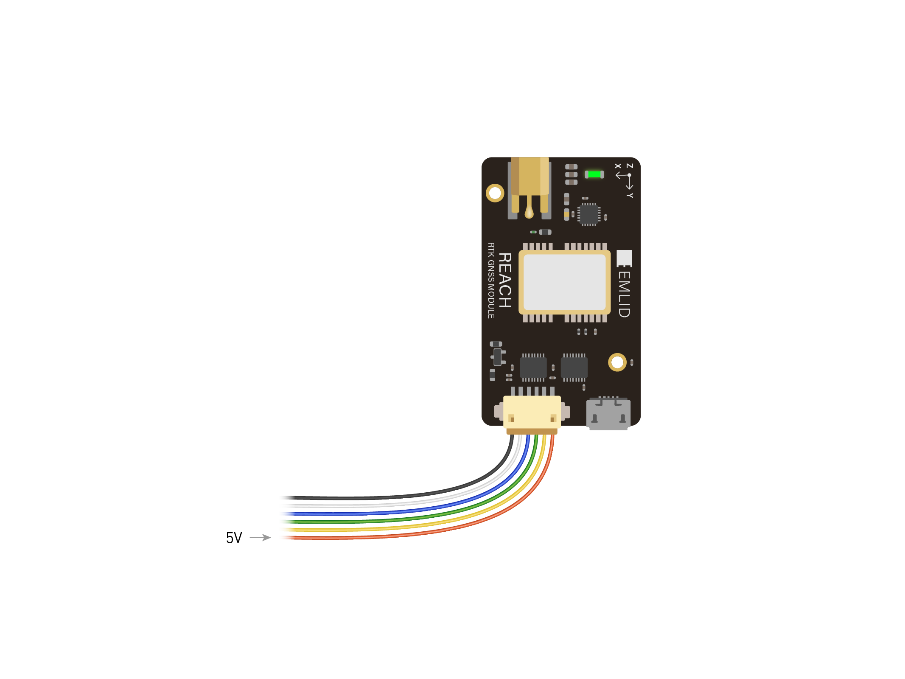
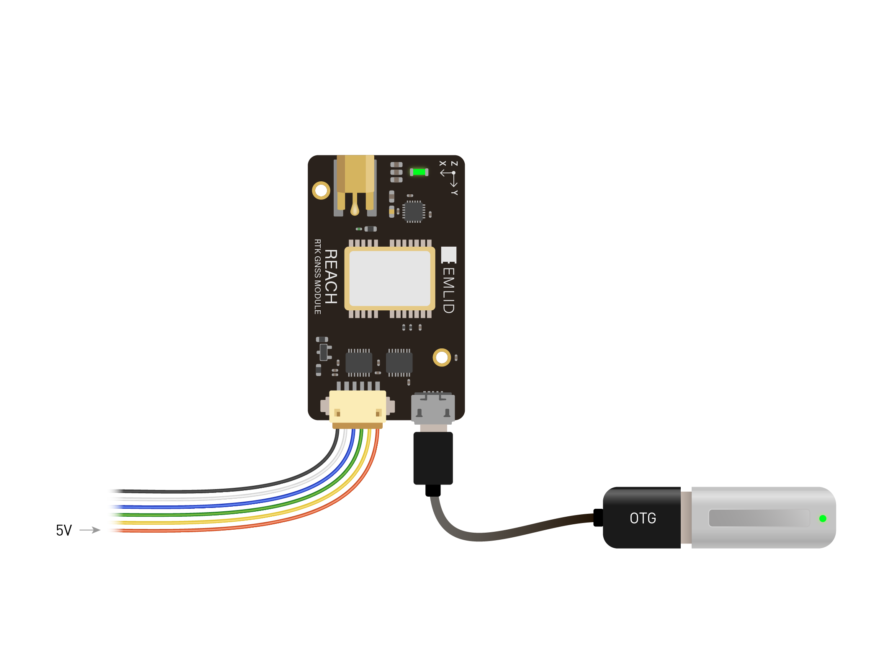

## Comment alimenter un module Reach RTK

Le module Emlid Reach RTK peut être alimenté soit par le port **Micro-USB** ou un des ports **DF13**. Le circuit d'alimentation est partagé par tous les ports, donc si un des ports alimente l'appareil alors les autres ports seront aussi alimentés.

!!! attention
    Ne pas connecter deux alimentations en même temps cela pourrait endommager l'appareil.

 

### Alimentation par l'USB

 

Vous pouvez alimenter le module Reach en utilisant différentes sources comme:

* un chargeur USB externe
* un adapteur USB mural
* les ports USB d'un ordinateur

 

### Alimentation par les ports DF13

Le module Reach peut être alimenté en fournissant du 5V sur les broches correspondantes d'un des deux ports DF13.

 

Quand le module Reach est alimenté par un port DF13, il pourra alimenter les appareils connectés sur le port Micro-USB OTH comme une clef USB, un modem 3G/4G, une radio USB, etc...

 
