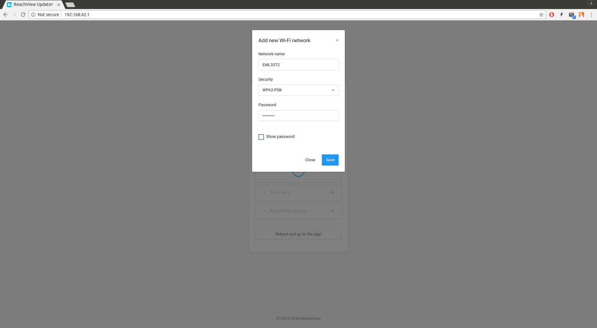
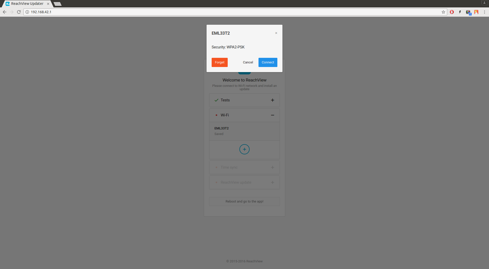
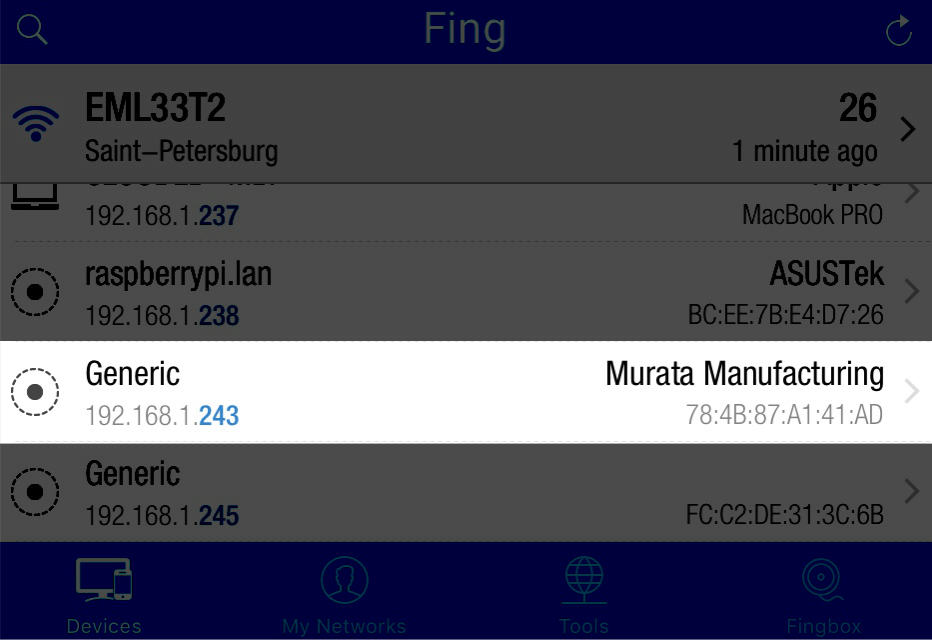
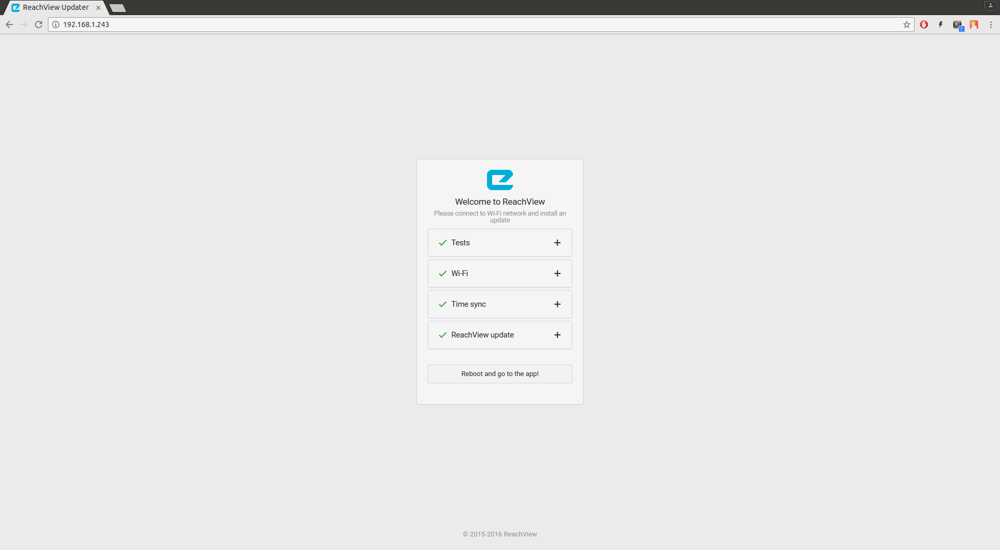
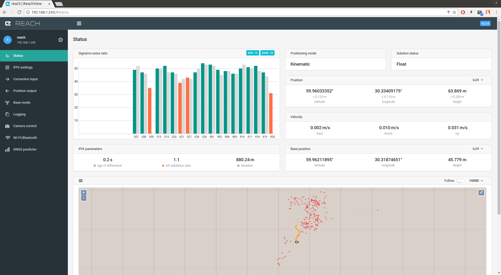
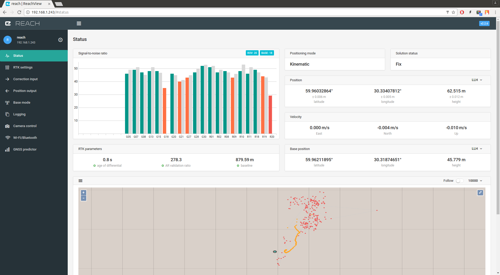

## Intro

Dans ce tutorial rapide nous allons vous montrer comment configurer deux modules Reach en tant que station fixe (base) et récepteur mobile (rover) avec transmission des corrections par Wi-Fi.

!!! tip "Astuce"
	Si vous rencontrez un problème en effectuant ces étapes, nous vous aiderons volontiers sur le [forum de la  communauté (en anglais)](http://community.emlid.com/)

Ce tutoriel ne concerne qu'un seul cas d'usage. Pour obtenir plus d'informations, cliquez sur un de ces liens :

* [Caractéristiques Mécaniques](specs/#mechanical-specs)
* [Caractéristiques Electriques](specs/#electrical-specs)
* [Intégration Matérielle](hardware-integration)
* [Interface ReachView](common/reachview/)

## Alimenter le module

* Prendre le câble **Micro-USB <--> USB** fourni

* Connecter **l'extrémité Micro-USB** du câble au **port Micro-USB** du module Reach et connecter l'autre extrémité à une source de tension 5V comme une batterie USB, un prise d'alimentation USB ou le port USB de votre ordinateur.

!!! danger "Danger"
	Ne pas connecter deux source de tension en même temps, cela risquerait d'endommager l'appareil.

Plus de détails concernant l'alimentation sont disponibles [ici](power-supply/).

## Connecter et placer l'antenne GPS

* Connecter le câble antenne au connecteur MCX du module Reach.

* Disposer l'antenne sur un plan de masse. Par exemple une pièce de métal dont le diamètre est supérieur à 100 mm, un toit de voiture, ou un toit métallique d'un bâtiment.

!!! warning "Attention"
	Il **ne doit pas** y avoir d'obstacles près de l'antenne pouvant obstruer la vue du ciel au délà de 30 degrés au dessus de l'horizon.
	**Ne pas** essayer l'appareil en intérieur ou à proximité de bâtiments, ne pas obstruer la vue du ciel pour les antennes avec un ordinateur, une voiture ou vous-même. Le RTK nécessite une bonne visibilité satellite et une bonne réception.

Une guide expliquant comment disposer l'antenne est disponible dans la section [Positionner l'antenne](antenna-placement).

## Se connecter au module Reach

Quand le module Reach est allumé pour la première fois il créera un hotspot Wi-Fi.

* Afficher la liste des réseaux Wi-Fi depuis votre smartphone, tablette ou ordinateur.

* Se connecter au réseau appelé **reach:xx:xx** (ex. reach:66:ac).

* Taper le mot de passe du réseau: **emlidreach**.

## Configurer le Wi-Fi

Une fois connecté au réseau hébergé par le module Reach, ouvrir un navigateur internet depuis votre smartphone, tablette ou ordinateur.

* Taper soit **http://reach.local** ou **http://192.168.42.1** dans la barre d'adresse et vous verrez le module de mise à jour ReachView Updater.

 

!!! note "Remarque"
	Si votre interface est complètement différente, il est nécessaire de reprogrammer le module Reach avec l'image v2.3 en suivant [ce guide](common/reachview/firmware-reflashing). Vous avez uniquement besoin de réaliser cette étape si votre appareil a été acheté avant le 1er Mars 2017.

* Appuyer sur le bouton plus et entrer le nom de votre réseau Wi-Fi, type de sécurité et mot de passe. Cliquer sur le bouton Enregistrer.

 

* Cliquer sur votre réseau nouvellement ajouté puis sur "Connect"

 

* Une fois cette étape réalisée le module Reach essaiera de se connecter à ce réseau Wi-Fi.

!!! tip "Astuce"
    Si votre appareil ne s'est pas connecté au réseau Wi-Fi il basculera en mode hotspot.
    Vous pouvez trouver le module Reach à l'adresse **http://reach.local** ou **http://192.168.42.1**.
    Vérifier le nom de votre réseau et mot de passe et essayer à nouveau.

## Accéder au module Reach sur le réseau

Une fois le module Reach connecté à un réseau Wi-Fi existant, vous aurez besoin d'identifier son adresse IP.

Pour cela vous pouvez utiliser:

* L'application "**Fing**" pour [iOS](https://goo.gl/Ho0qB) ou [Android](https://goo.gl/7Wuwu).

* ["**Nmap**"](https://nmap.org/) sur Linux/OS X.

* ["**Zenmap**"](https://nmap.org/zenmap/) sur Windows.

 

* Le module Reach apparaitra en tant qu'appareil "**Murata Manufacturing**" dans ces applications.

* Renseigner l'adress IP du module Reach dans la barre d'adresse de votre navigateur et valider.

Plus de détails sur la résolution des adresses IP sont disponibles dans la [section ReachView](common/reachview/).

* Après cela vous verrez l'utilitaire de mise à jour ReachView Updater qui installera les dernières mises à jour.

 

* Appuyer sur le bouton **Reboot and go to the app!** button. Attendre jusqu'au redémarrage du module.

* Une minute plus tard environ rafraichissez la page de l'application ReachView.

 

## Utiliser l'application ReachView

### Présentation de l'interface

 

Le menu ReachView comporte 9 onglets, mais seulement trois sont nécessaires pour commencer à travailler:

* **Status** : cet onglet affiche les niveaux de réception satellite, paramètres RTK, coordonnées et cartes.

* **Base mode** (mode station fixe) : cet onglet est utilisé pour paramétrer les corrections de sortie, les coordonnées de la station fixe (base) et les messages RTCM3.

* **Correction input** (correction en entrée) : cet onglet est utilisé pour paramétrer les corrections reçues par le récepteur mobile (rover) depuis une station fixe (base).

### Paramétrer la station fixe (base)

* Se connecter au module Reach que vous souhaitez utilisé en tant que station fixe.

* Naviguer dans l'onglet **Base mode** et activer l'élément de correction de sortie "Correction output".

* Attendre jusqu'à ce que la station fixe moyenne ses coordonnées dans la section "Base coordinates".

 

Par défaut, le flux de sortie de la base sera disponible sur le **port TCP 9000**.

### Paramétrer le récepteur mobile (rover)

* Se connecter au second module Reach.

* Naviguer dans l'onglet de correction en entrée **Correction input**.

 

* Sélectionner le mode de correction via TCP.

* Sélectionner **Client** dans le champ **Role**.

* Ajouter l'adresse IP de la station fixe dans le champs **Address**.

* Ajouter le port de la station fixe dans le champs **Port**. **9000** par défaut.

* Choisir le **Format** des corrections en entrée. **RTCM3** par défaut.

 

* Enregistrer et appliquer les paramètres en appuyant sur le bouton **Apply**.

### Afficher les résultats

* Aller dans l'onglet **Status** de l'application sur le module du récepteur mobile.

 

Vous pouvez voir un graphique avec les niveaux satellites, paramètres RTK, mode de positionnement et statut de la solution, coordonnées actuelles du récepteur mobile et fixe au format LLH, vitesse et carte. Dans ce tutoriel rapide, le mode de positionnement dynamique (Kinematic) est sélectionné, il s'agit du mode le plus courant pour du RTK.

* Si tout a bien été configuré, **Solution status** sera **Float** et **vous devriez voir des barres grises à côté des barres des niveaux de réception satellite**.

!!! warning "Attention"
    **Float** signifie que les corrections de la station fixe (base) sont utilisées et que le positionnement est relatif aux coordonnées de la base, mais l'ambiguité de résolution à l'entier le plus proche n'a pas été encore levée.  
	
    Si vous voyez **"-"** ou **Single** dans le cadran **Solution status** à cette étape, cela signifie que quelque chose ne fonctionne pas.

    **"-"** signifie que le logiciel ne dispose d'aucune information à traiter. Soit il faut plus de temps, soit l'antenne n'est pas positionnée correctement.

    **Single** signifie que le récepteur mobile a trouvé une solution dépendant uniquement de son récepteur mais que les corrections de la base ne sont pas utilisées. Si le rover est démarré dans le mode de positionnement "Single", l'affichage sera également celui-là.

* Si tout a bien été configuré et que la station fixe et le récepteur mobile ont des bonnes visibilités satellite, vous devriez voir **Solution status** passer à **Fix** en quelques minutes. **Fix** signifie que le mode de postionnement est relatif à la base et que l'ambiguité de résolution à l'entier le plus proche est levée.

 

* Maintenant vous pouvez voir des points  verts sur la carte ci-dessous. Les points  oranges  sont pour les solutions **Float**.  Rouge  pour les solutions **Single**.

* Vous êtes fin prêt!

## Plus de lecture

Félicitations, vous avez terminé le guide de démarrage! Continuez l'apprentissage concernant les différents modes de transmission des corrections dans la [section ReachView](common/reachview).
