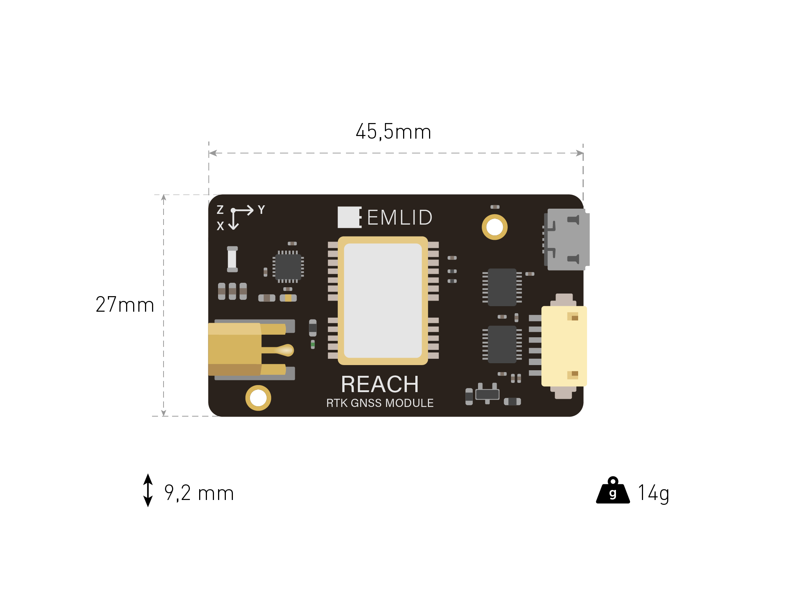
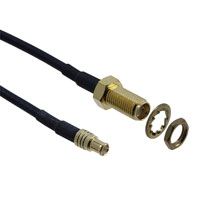
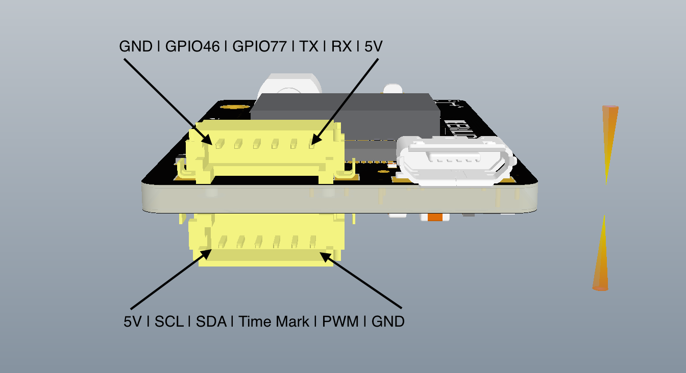
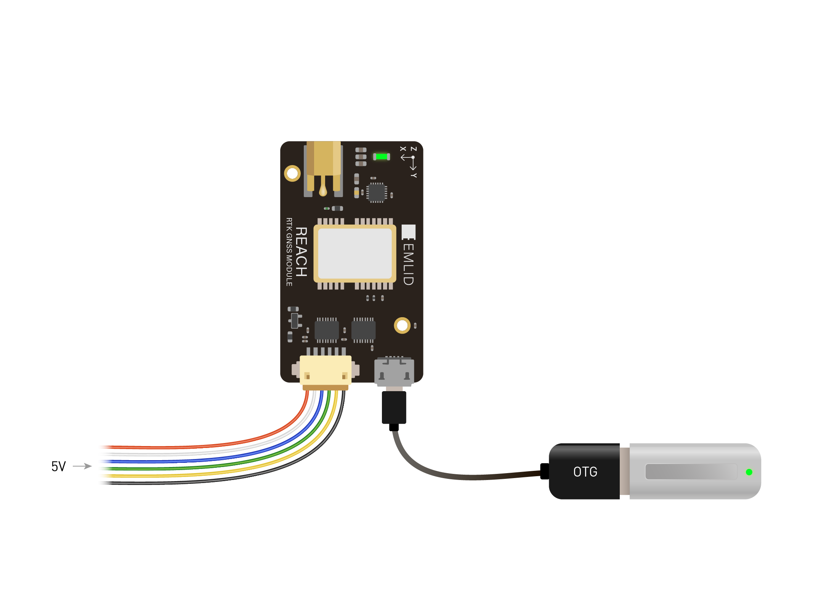

## Caractéristiques Mécaniques

### Dimensions

Le module Reach RTK est un petit appareil, sa taille est de quelques millimètres plus large que la carte Intel Edison qu'il intègre.

 

### Elements de connexion

Le module Reach comporte deux connecteurs DF13 et est fourni avec tous les câbles requis pour se connecter à d'autres appareils. Si vous avez besoin de réaliser vos propres câbles de connexion voici les références des connecteurs utilisés:

* Sur le module Reach: Hirose DF13-6P-1.25H(50) ([Digikey](http://www.digikey.com/product-detail/en/DF13-6P-1.25H%2850%29/H3354-ND/530653), [Mouser](http://eu.mouser.com/ProductDetail/Hirose-Electric/DF13-6P-125H50/?qs=%2fha2pyFaduilOJdMONLaLBwaFNH0V7VnzXasUV9hMRidfNFMCnSnIA%3d%3d)).

* Connecteur femelle: Hirose DF13-6S-1.25C ([Digikey](http://www.digikey.com/product-search/en?keywords=DF13-6S-1.25C), [Mouser](http://eu.mouser.com/ProductDetail/Hirose-Electric/DF13-6S-125C/?qs=%2fha2pyFaduhJ5h7X7LLPzEL0u%2f%252b1ZTztM8mMa9tEuYmcKFXQSgLZyQ%3d%3d))

Le connecteur antenne est de type MCX, pour connecter un cable d'antenne SMA ou TNX vous pouvez utiliser un des nombreux adapteurs.
 ([câble](http://www.digikey.com/product-detail/en/CAB.0130/931-1102-ND/2332729), [adapteur](http://www.digikey.com/product-detail/en/242127/ACX1348-ND/1012025))

 

### Modèle 3D

Ce modèle 3D peut servir de référence pour la conception de boitier. Veuillez noter que le module Reach comporte une enveloppe protectrice thermorétrécissable qui augmente légèrement ses dimensions extérieures.

Lors de la conception d'un boitier gardez à l'esprit que vous ne devez rien placer près de l'antenne Wi-Fi ou sinon les performances pourront être diminuées. Essayez de laisser au moins 5mm de distance à l'objet le plus proche.

### Boitier 3D

 

Les boitiers en impression 3D suivants sont disponibles pour les utilisateurs des modules Reach:

**Boitier Reach modèle C:**

Télécharger la [moitié supérieure et inférieure](https://github.com/emlid/hardware/tree/master/Reach_cases/Rev_C_parts) du boitier pour l'imprimer en 3D.

**Boitier Reach modèle D:**

Télécharger la [moitié supérieure et inférieure](https://github.com/emlid/hardware/tree/master/Reach_cases/Rev_D_parts) du boitier pour l'imprimer en 3D.

**Boitier Reach modèle E:**

Télécharger la [moitié supérieure et inférieure](https://github.com/emlid/hardware/tree/master/Reach_cases/Rev_E_parts) du boitier pour l'imprimer en 3D.

Lors de l'assemblage, les boitiers D et E nécessitent une vise DIN-7981 (diamètre de filetage 2.2 mm, longueur 6.5 ou 9.5 mm). Le boitier C peut être assemblé avec un skotch.

## Caractéristiques électriques

### Valeurs maximales

|Nom                                                | Valeur                |
|---------------------------------------------------|-----------------------|
| Tension d'entrée sur les connecteurs USB et DF13  | 4.75 - 5.5 V          |
| Niveaux logiques sur toutes les broches           | 3.3 V                 |
| Tension d'entrée maximale sur toutes les broches  | 5.5 V                 |
| Biais DC Antenne                                  | 3.3 V                 |
| Courant de sortie de l'antenne                    | 100 mA                |
| Consommation maximale de courant @5V              | 500 mA                |
| Consommation nominale de courant @5V              | 200 mA                |
| Courant limite sur le port USB OTG                | 1000 mA               |
| Plage de température                              | 0 +40 C (-40 +85 C)^  |

Officiellement, la carte Intel Edison est spécifiée 0C à 40C, mais Intel affirme qu'ils réalisent des tests de température avec de bons résultats mais qu'ils ne sont encore par prêts pour étendre les spécifications officielles au delà. Des utilisateurs rapportent des tests réussis à -40C.

### Brochage des connecteurs

 

* GPIO46, GPIO77, PWM, SCL, SDA, TX, RX sont connectés à la carte Intel Edison via des buffers et fonctionnent avec des niveaux logiques de 3.3V, mais tolérants au 5V.
* TX et RX correspondent à l'UART1 de la carte Intel Edison.
* SCL et SDA correspondent à I2C1 de la carte Intel Edison, I2C1 peut aussi être utilisé pour communiquer avec le magnétomètre interne du MPU9250.
* PWM correspond au PWM3 GPIO183 de la carte Intel Edison.
* L'entrée Time Mark est directement connectée à la puce U-blox pour une latence réduite, inclue un limiteur de surtension, une résistance de type pull up et de limitation de courant.

### USB OTG

 

Le module Reach peut à la fois être alimenté par l'USB, agir en tant qu'appareil et source de courant quand il est connecté comme Hôte sur le port. Pour utiliser le module Reach en OTG il est nécessaire de connecter une alimentation 5V par les broches du connecteur DF13 (5V et GND), et d'utiliser un câble USB OTG.
