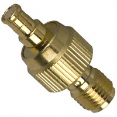

## Caractéristiques Mécaniques

### Dimensions

Le module Reach RTK est un petit appareil, sa taille est de quelques millimètres plus large que la carte Intel Edison qu'il intègre.

 

### Elements de connexion

Le module Reach comporte deux connecteurs DF13 et est fourni avec tous les câbles requis pour se connecter à d'autres appareils. Si vous avez besoin de réaliser vos propres câbles de connexion voici les références des connecteurs utilisés:

* Sur le module Reach: Hirose DF13-6P-1.25H(50) ([Digikey](http://www.digikey.com/product-detail/en/DF13-6P-1.25H%2850%29/H3354-ND/530653), [Mouser](http://eu.mouser.com/ProductDetail/Hirose-Electric/DF13-6P-125H50/?qs=%2fha2pyFaduilOJdMONLaLBwaFNH0V7VnzXasUV9hMRidfNFMCnSnIA%3d%3d)).

* Connecteur femelle: Hirose DF13-6S-1.25C ([Digikey](http://www.digikey.com/product-search/en?keywords=DF13-6S-1.25C), [Mouser](http://eu.mouser.com/ProductDetail/Hirose-Electric/DF13-6S-125C/?qs=%2fha2pyFaduhJ5h7X7LLPzEL0u%2f%252b1ZTztM8mMa9tEuYmcKFXQSgLZyQ%3d%3d))

Le connecteur antenne est de type MCX, pour connecter un cable d'antenne SMA ou TNX vous pouvez utiliser un des nombreux adapteurs.
 ([cable](http://www.digikey.com/product-detail/en/CAB.0130/931-1102-ND/2332729), [adapter](http://www.digikey.com/product-detail/en/242127/ACX1348-ND/1012025))

 

### Modèle 3D

Ce modèle 3D peut servir de référence pour la conception de boitier. Veuillez noter que le module Reach comporte une enveloppe protectrice thermorétrécissable qui augmente légèrement ses dimensions extérieures.

Lors de la conception d'un boitier gardez à l'esprit que vous ne devez rien placer près de l'antenne Wi-Fi ou sinon les performances pourront être diminuées. Essayez de laisser au moins 5mm de distance à l'objet le plus proche.

### Boitier 3D

 

Les boitiers en impression 3D suivants sont disponibles pour les utilisateurs des modules Reach:

**Reach case model C:**

Télécharger la [moitié supérieure et inférieure](https://github.com/emlid/hardware/tree/master/Reach_cases/Rev_C_parts) du boitier pour l'imprimer en 3D.

**Reach case model D:**

Télécharger la [moitié supérieure et inférieure](https://github.com/emlid/hardware/tree/master/Reach_cases/Rev_D_parts) du boitier pour l'imprimer en 3D.

**Reach case model E:**

Télécharger la [moitié supérieure et inférieure](https://github.com/emlid/hardware/tree/master/Reach_cases/Rev_E_parts) du boitier pour l'imprimer en 3D.

Lors de l'assemblage, les boitiers D et E nécessitent une vise DIN-7981 (diamètre de filetage 2.2 mm, longueur 6.5 ou 9.5 mm). Le boitier C peut être assemblée avec un skotch.

## Caractéristiques électriques

### Valeurs maximales

|Name                                       | Value                |
|-------------------------------------------|----------------------|
| Inout voltage on USB and DF13 connectors  | 4.75 - 5.5 V         |
| Logic levels on all pins                  | 3.3 V                |
| Max input voltage on all pins             | 5.5 V                |
| Antenna DC bias                           | 3.3 V                |
| Antenna output current                    | 100 mA               |
| Max current consumption @5V               | 500 mA               |
| Normal current consumption @5V            | 200 mA               |
| Current limit on USB OTG                  | 1000 mA              |
| Temperature range                         | 0 +40 C (-40 +85 C)^ |

Officially Intel Edison is rated 0C to 40C, but Intel also claims they are performing temperature tests with good results, but just are not yet ready to officially rate Edison as extended temperature range device. Users report successful tests down to -40 C.

### Connectors pinout

 

* GPIO46, GPIO77, PWM, SCL, SDA, TX, RX are connected to Intel Edison via buffers and are 3.3 V logic level, 5 V tolerant.
* TX and RX belong to UART1 on Intel Edison
* SCL and SDA belong to I2C1 on Intel Edison, I2C1 also could be used to communicate with internal magnetometer in MPU9250.
* PWM belongs to PWM3 GPIO183 on Intel Edison
* Time Mark input is connected directly to U-blox chip for low latency, it includes an over-voltage clamp, pull up and current limiting resistor.

### USB OTG

 

Reach can both receive power from USB, acting as a device and source power to the port acting as a host. To use Reach in OTG mode you will need to connect 5V power source to DF13 connector pins (5 V, GND) and use OTG USB cable.
